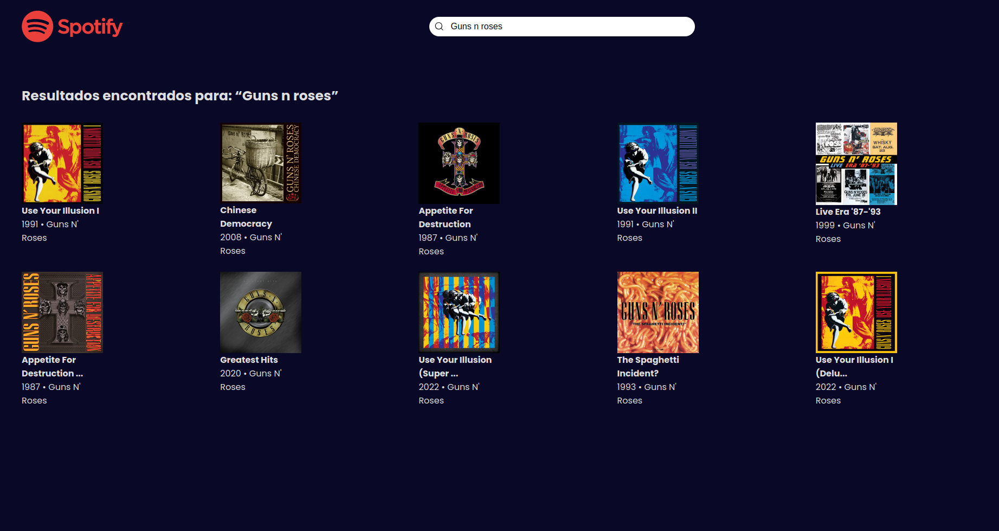
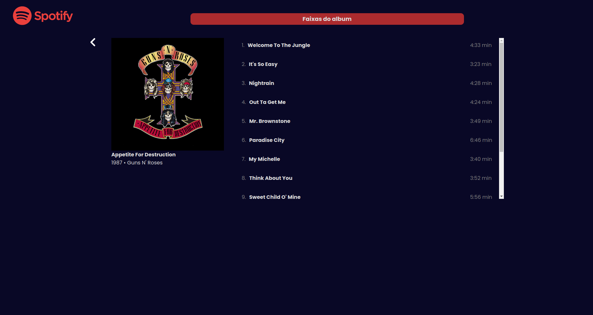
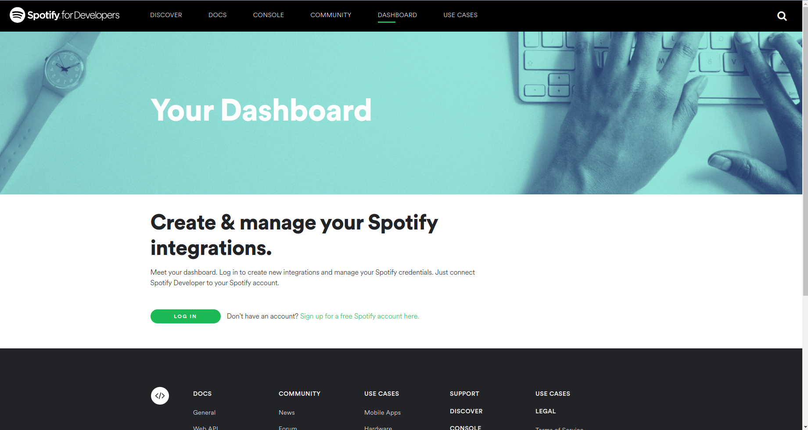
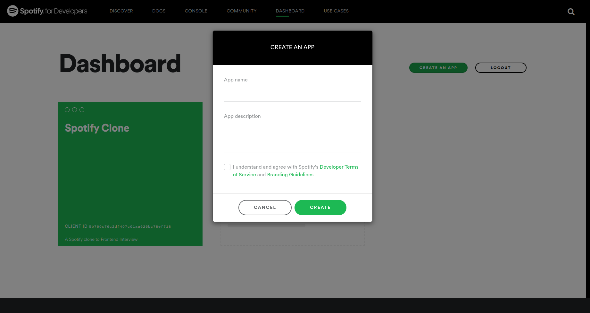
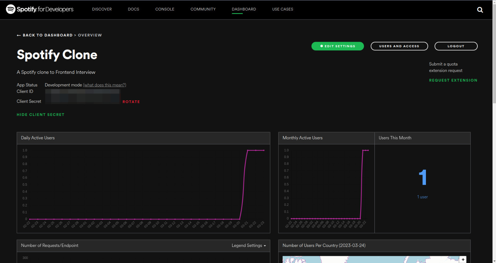
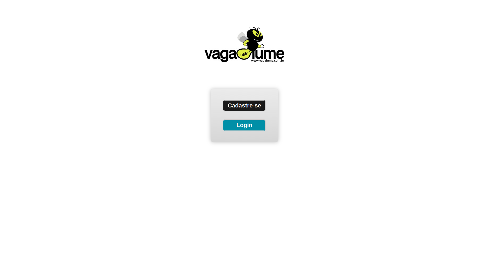
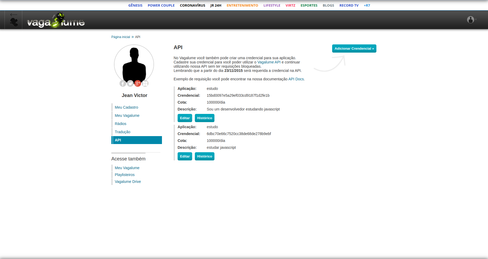

<p align="center">
  
<p>

<p align="center">
  

  

  
  <a href="https://github.com/JeanVictor44/spotify/commits/main">
    
  </a>

  
</p>


## :computer: Sobre o projeto
:film_strip: Spotify é um projeto para quem ama música e quer encontrar facilmente o album dos seus artistas favoritos   



> Home Page

## :art: Layout
<p align="center" style="display: flex; align-items: flex-start; justify-content: center;">
    
</p>

## :hammer_and_wrench: Tecnologias

As seguintes ferramentas foram usadas na construção do projeto:

- [React](https://pt-br.reactjs.org/)
- [TypeScript](https://www.typescriptlang.org/)
- [React-Router-Dom v6](https://reactrouter.com/docs/en/v6)
- [Styled-components](https://styled-components.com/)
- [Axios](https://axios-http.com/docs/intro)
- [Npm](https://www.npmjs.com/)
- [Vite](https://vitejs.dev/)

### Funcionalidades

O projeto conta com as seguintes funcionalidades:

- [x] Pesquisar álbuns 
- [x] Listar faixas de um álbum
- [x] Visualizar detalhes de uma faixa
- [x] Visualizar letra de uma faixa
- [x] Escutar demo de uma faixa


## Pré-requisitos

Antes de começar, você vai precisar ter instalado em sua máquina as seguintes ferramentas:
[Git](https://git-scm.com), [Node.js](https://nodejs.org/). Além disto é bom ter um editor para trabalhar com o código como [VSCode](https://code.visualstudio.com/)

## :rocket: Preparando o projeto

```bash
# Clone este repositório
$ git clone https://github.com/JeanVictor44/spotify

# Acesse a pasta do projeto no seu terminal/cmd
$ cd spotify

# Instale as dependências
$ yarn install
```

Este projeto consome duas APIS externas: [Spotify Web API](https://developer.spotify.com/dashboard/) e [Vagalume API](https://auth.vagalume.com.br/). Vamos aprender a configura-las 
### Spotify API
##### Passo 1: Acesse o link do [Spotify Web API](https://developer.spotify.com/dashboard/) e crie uma conta Spotify ou faça login
  

##### Passo 2: Selecione CREATE AN APP e registre um app na sua conta spotify


##### Passo 3: Copie seu Client ID e Client Secret, em seguida crie um arquivo .env na raiz 
##### do projeto seguindo o exemplo do arquivo [.env.example](.env.example) e preencha as variáveis com 
##### os clients copiados


:bulb: Não se esqueça de configurar as variáveis de ambiente levando em conta o arquivo de exemplo [.env.example](.env.example)

### Vagalume API
##### Passo 1: Acesse o link do [Vagalume API](https://developer.spotify.com/dashboard/) e crie uma conta Vagalume ou faça login


##### Passo 2: Acesse este link para [Criar credencial ](https://auth.vagalume.com.br/settings/api/) e preencher o seu .env com a chave 
##### api do vagalume


### :coffee: Rodando a aplicação 


```bash
  # Execute a aplicação em modo de desenvolvimento
  
  $ yarn dev
  
  # A aplicação será aberta na porta:5173 - acesse http://localhost:5173/

```


## :pencil: Licença

Esse projeto está sob licença. Veja o arquivo [LICENÇA](LICENSE) para mais detalhes.
